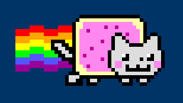

# pixel-art

  generate pixel art programatically

## Install

```
npm install pixel-art
```

## Example

```js
var pixel = require('pixel-art');

var nyan = pixel.art([
    '                  BBBBBBBBBBBBBBBBB',
    '                 B-----------------B',
    '                B--**************---B',
    '    rrrr    rrrrB--******@**@*****--B',
    'rrrrrrrrrrrrrrrrB-**@**************-B',
    'rrrroooorrrrooooB-**********BB*@***-B BB',
    'ooooooooooooooooB-*********B..B****-BB..B',
    'ooooyyyyooBBBByyB-******@**B...B***-B...B',
    'yyyyyyyyyyB..BByB-*********B....BBBB....B',
    'yyyyggggyyBB..BBB-***@*****B............B',
    'gggggggggggBB..BB-********B..............B',
    'ggggbbbbggggBB..B-*@******B...^B.....^B..B',
    'bbbbbbbbbbbbbBBBB-******@*B...BB...B.BB..B',
    'bbbbmmmmbbbbmmmBB-********B.**.........**B',
    'mmmmmmmmmmmmmmmmB--*@*****B.**.B..B..B.**B',
    'mmmm    mmmm    B---*******B...BBBBBBB..B',
    '               BBB----------B..........B',
    '              B...BBBBBBBBBBBBBBBBBBBBB',
    '              B..BB B..B     B..B B..B',
    '              BBBBB BBB       BBB  BB',
  ])
  .palette({
    'r': 'red',
    'o': 'orange',
    'y': 'yellow',
    'g': '#0f0',
    'b': '#55f',
    'm': '#909',
    'B': 'black',
    '.': '#ddd',
    '-': '#ffa',
    '*': '#f8e',
    '@': '#b09',
    '^': 'white'
  })
  .pos({ x: 20, y: 20 })
  .scale(6)
  .draw(canvas.getContext('2d'));
```

Result:



## Export

To export to a base64 code, use:

```js
var filetype = 'image/png' // default: 'image/webp'
var ratio = 0.5 // default: 1

nyan.export(filetype, ratio)
// <- String
```


## Save

To save the compressed art string, use:

```js
nyan.save()
// <- Compressed string with art and palette
```

> It uses [LZ-String](https://github.com/pieroxy/lz-string/). In the example, it compressed 25% more compared to the image/webp string compression

## Load

To load the compressed art string, use:

```js
var PixelArt = require('pixel-art');
new PixelArt().load(nyan.save()).pos({ x: 20, y: 20 })
.scale(6)
.draw(canvas.getContext('2d'));
```

Will output the same result:


## License

MIT © [stagas](https://github.com/stagas)
